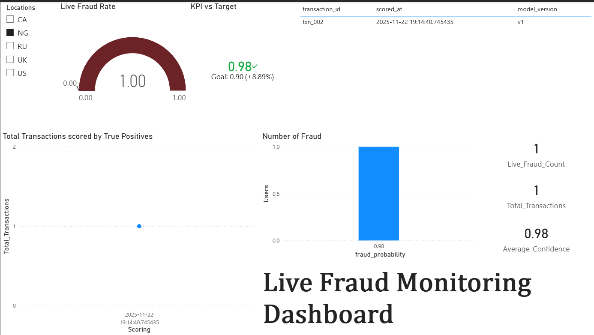

# 🛡️ MLOps Fraud Detection Dashboard

## Overview

This project delivers a **production-ready, end-to-end dashboard** for monitoring a machine-learning–powered fraud detection system.  
It is designed to serve two primary user groups:

- **Fraud Operations Analysts** – who require real-time alerts, monitoring, and operational KPIs.  
- **Data Scientists / ML Engineers** – who need visibility into model health, performance trends, and data drift through core MLOps metrics.

The dashboard unifies multiple data sources using a star-schema-like structure and DAX measures to generate dynamic insights.

---

## 📘 Data Model Overview

The dashboard integrates **three main tables** and one **baseline dataset**, joined primarily on `version` where applicable. DAX measures drive most KPIs and interactive visuals.

| Table | Purpose | Relationship |
|-------|---------|--------------|
| **Fact_RealTimeScores** | Stores each live transaction, the model’s fraud score (`fraud_probability`), and the actual outcome (`is_fraud`). *(Fact table)* | Many-to-One → **Dim_Model.version** |
| **Dim_Model** | Stores model metadata, version history, and deployment stage (e.g., *Production, Staging*). *(Dimension table)* | One-to-Many → **Fact tables** |
| **Fact_Metrics** | Contains historical offline performance metrics such as ROC-AUC, F1, and Precision for each model version. *(Fact table)* | Many-to-One → **Dim_Model.version** |
| **creditcard_training** | Baseline training dataset used for drift detection. | No active relationship |

---

## 🧮 Key DAX Measures

These measures power the dashboard’s KPIs and real-time insights:

- **Total_Transactions** – total transaction count.
- **Live_Fraud_Count** – number of fraud predictions (`is_fraud = 1`).
- **Live_Fraud_Rate** – fraud alerts as a percentage of all transactions.  
  *Formula: `[Live_Fraud_Count] / [Total_Transactions]`*
- **Average_Confidence** – mean model prediction confidence.
- **Current_Model_Version** – currently deployed model version (from `current_stage = "Production"`).

---

## 📊 Dashboard Pages

### 1. 🟢 Real-Time Operational Monitor  
**Audience: Fraud Analysts**

Supports day-to-day operations with instant visibility into live system behavior.

| Visual | Data / Measure | Purpose |
|--------|----------------|---------|
| **KPI Cards** | `[Total_Transactions]`, `[Live_Fraud_Count]`, `[Live_Fraud_Rate]`, `[Average_Confidence]`, `[Current_Model_Version]` | Quick snapshot of current performance and system health. |
| **Map Visual** | Location field (size by `[Total_Transactions]`) | Shows live transaction flow and fraud hotspot regions. |
| **Live Alerts Table** | Transaction ID, Amount, fraud_probability | Prioritized list of high-confidence fraud alerts (e.g., ≥ 0.85). |
| **Volume Trend Chart** | `[Total_Transactions]` over `scored_at` | Confirms stable data ingestion and traffic patterns. |

---

### 2. 📈 Model Performance History  
**Audience: ML Engineers**

Tracks historical model performance based on stored offline evaluation metrics.

| Visual | Data Source | Purpose |
|--------|-------------|---------|
| **ROC-AUC Trend** | `Fact_Metrics[roc_auc]` vs. `Dim_Model[registration_date]` | Monitors long-term model quality across versions. |
| **F1-Score Comparison** | `Fact_Metrics[f1_score]` vs. `Dim_Model[version]` | Version-to-version comparison aligned with business needs. |
| **Production Version Card** | `[Current_Model_Version]` filtered by `current_stage = "Production"` | Connects historical metrics with the model currently scoring live transactions. |

---

### 3. 📉 Data Drift & Verification  
**Audience: Data Scientists**

Detects shifts in data distributions compared to the training dataset.

| Visual | Data Source | Purpose |
|--------|-------------|---------|
| **Amount Distribution Comparison** | Binned `amount` values in live vs. training data | Primary indicator of feature drift; deviations suggest retraining. |
| **Confidence Trend (KPI)** | `[Average_Confidence]` over time | Detects concept drift; falling confidence implies new unseen patterns. |
| **Location Distribution** | Side-by-side pie charts (training vs. live data) | Reveals shifts in geographic patterns influencing fraud patterns. |

---

## ✔️ Summary

This dashboard provides:

- **Operational intelligence** for real-time fraud detection.  
- **MLOps visibility** for model lifecycle management.  
- **Data drift safeguards** to ensure long-term model reliability.  

It delivers a complete, maintainable monitoring solution for high-risk fraud detection environments.
